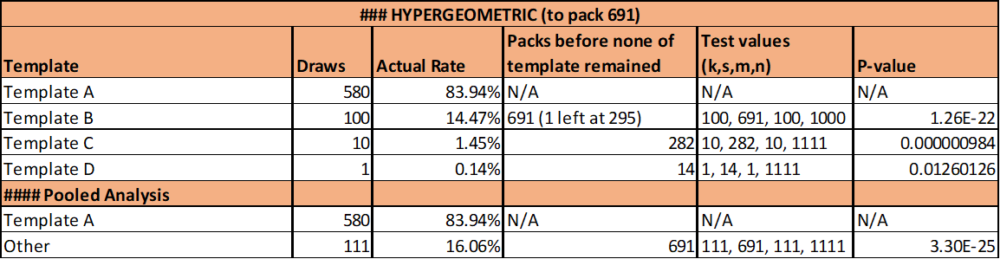

# guild-pack-data

## TL;DR 
**The problem has been patched by NeftyBlocks.**

These analyses show that the results of the GUILD currency card packs were unevenly distributed. 

### Files:

`cleaned_data.csv` - table containing draw data with rarities and running totals  
`analysis.csv` - results of hypergeometic probability calculations  

### TL;DR tables

Template A = Common, Template B = Rare, Template C = Secret Rare, Template D = Unique

**Analysis of pack opens 1-691 (when the final non-common was drawn)**  

**Analysis of pack opens 1-295 (after which only 1 rare remained)**  

