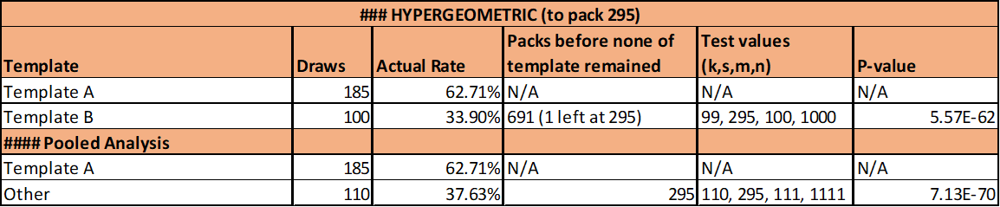

# guild-pack-data
Data dump from guild packs

`cleaned_data.csv` - table containing draw data with rarities and running totals
`analysis.csv` - results of hypergeometic probability calculations

### TL;DR tables

